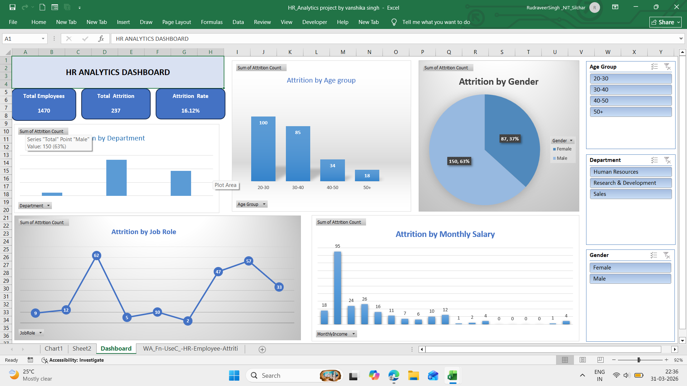

# HR Analytics Dashboard (IBM HR Dataset)
## 🎯 Project Title
This project focuses on analyzing employee attrition using HR data. 
The dashboard provides insights into factors like age, salary, department, and job role affecting attrition.
## 🎯 Objective
- To analyze employee attrition
- To identify key factors affecting employee turnover
- To help HR make better decisions
-  ## 📂 Dataset
- Source: IBM HR Analytics Dataset
- Total Records: 1470 employees
- Features: Age, Salary, Department, Job Role, Attrition, etc.
## 🛠 Tools & Technologies
- Microsoft Excel
- Pivot Tables
- Charts & Graphs
- Slicers 
## ⚙️ Process
1. Data Cleaning (Removed null values, formatted data)
2. Data Analysis using Pivot Tables
3. Created KPIs (Attrition Rate, Total Employees)
4. Built Dashboard using charts and slicers
## 📊 Key Insights
- High attrition in Sales department
- Younger employees have higher attrition rate
- Employees with low salary tend to leave more
## 📸 Dashboard Preview

## ✅ Conclusion
The analysis shows that salary, age, and department are major factors influencing attrition. 
Companies should focus on employee engagement and better compensation strategies.
## 🚀 Future Scope
- Use Power BI for advanced visualization
- Apply Machine Learning for prediction
